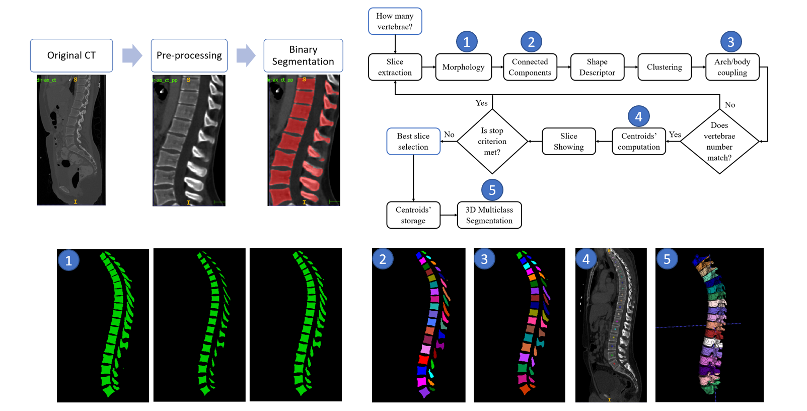
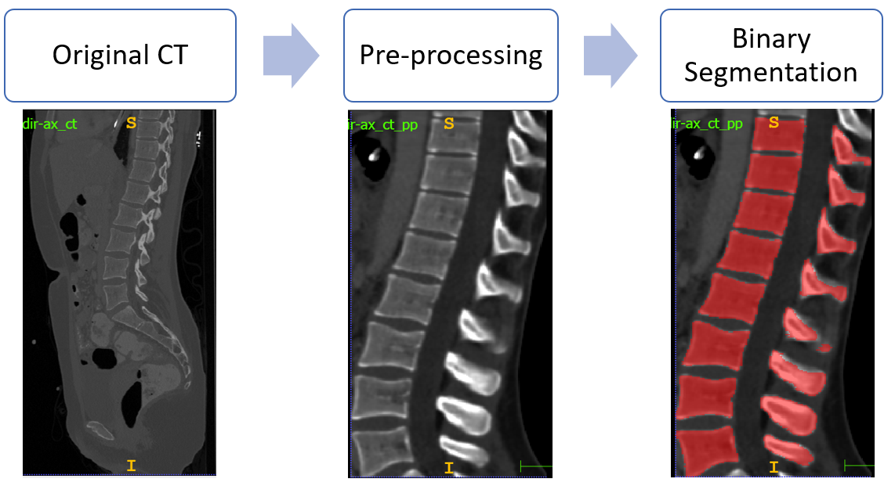
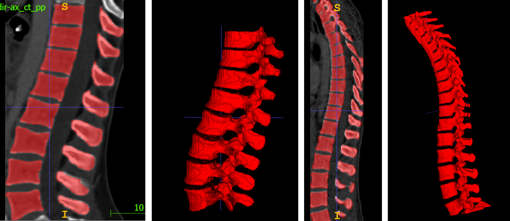
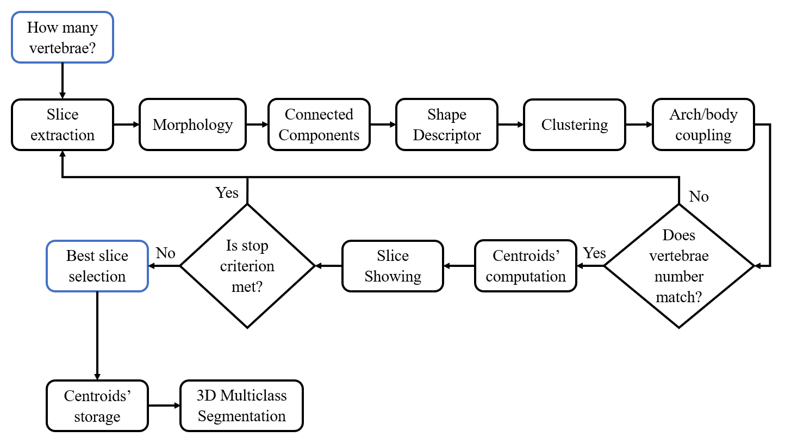
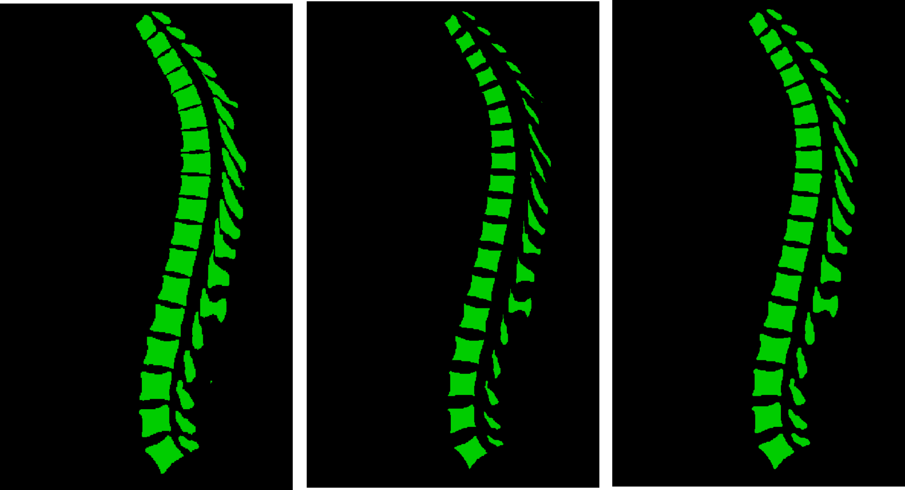
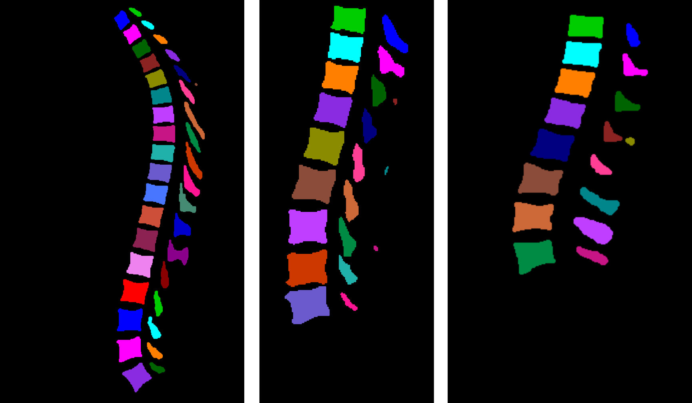
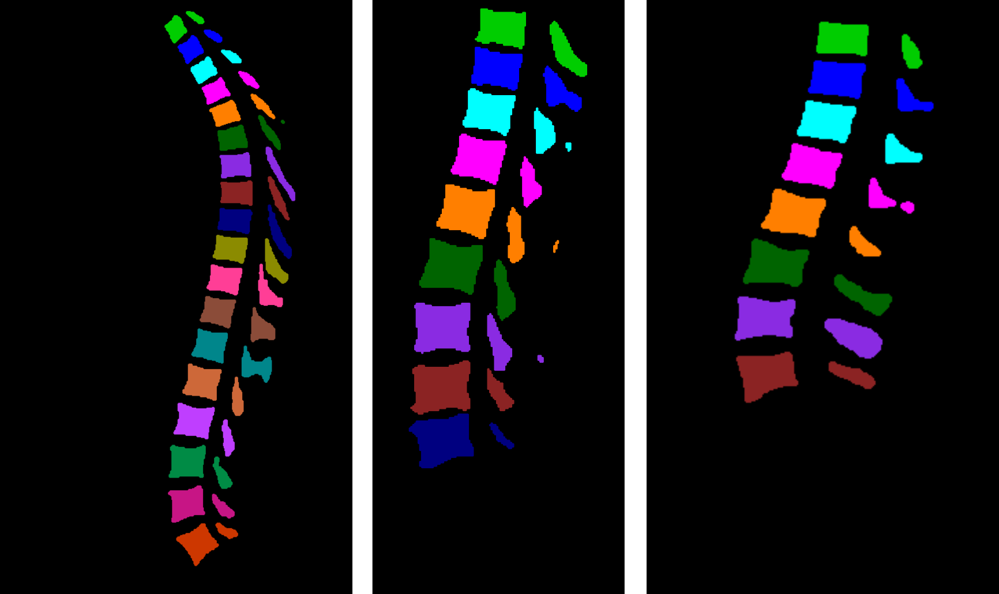
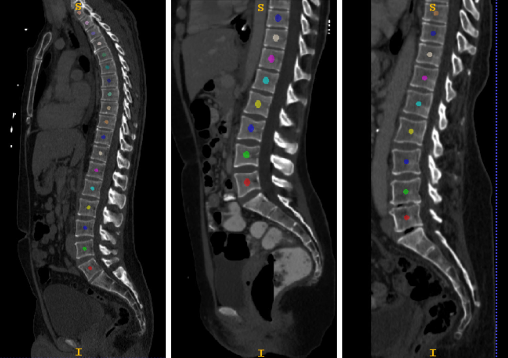
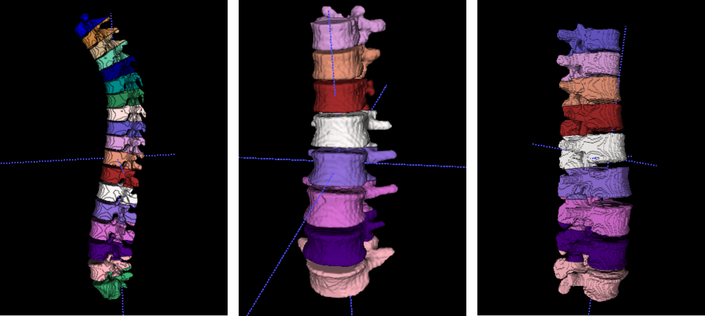

# Segmentation and Identification of Vertebrae in CT Scans using CNN, k-means Clustering and k-NN
If you use this code for your research, please cite our [paper](https://doi.org/10.3390/informatics8020040):

```
@Article{informatics8020040,
AUTHOR = {Altini, Nicola and De Giosa, Giuseppe and Fragasso, Nicola and Coscia, Claudia and Sibilano, Elena and Prencipe, Berardino and Hussain, Sardar Mehboob and Brunetti, Antonio and Buongiorno, Domenico and Guerriero, Andrea and Tatò, Ilaria Sabina and Brunetti, Gioacchino and Triggiani, Vito and Bevilacqua, Vitoantonio},
TITLE = {Segmentation and Identification of Vertebrae in CT Scans Using CNN, k-Means Clustering and k-NN},
JOURNAL = {Informatics},
VOLUME = {8},
YEAR = {2021},
NUMBER = {2},
ARTICLE-NUMBER = {40},
URL = {https://www.mdpi.com/2227-9709/8/2/40},
ISSN = {2227-9709},
DOI = {10.3390/informatics8020040}
}
```

Graphical Abstract:


------------------------------------------------------------------------------

## Materials

Dataset can be downloaded for free at this [URL](https://osf.io/nqjyw/).

------------------------------------------------------------------------------

## Configuration and pre-processing

Configure the file `config/paths.py` according to paths in your computer.
Kindly note that `base_dataset_dir` should be an absolute path which points to 
the directory which contains the subfolders with images and labels for training 
and validating the algorithms present in this repository.

In order to perform pre-processing, execute the following scripts in the
given order.

1) Perform Train / Test split:
```
python run/task0/split.py --original-training-images=OTI --original-training-labels=OTL \ 
                          --original-validation-images=OVI --original-validation-labels=OVL
```
Where:
- `OTI` is the path with the CT scan from the original dataset (downloaded from 
VerSe challenge, see link above);
- `OTL` is the path with the labels related to the original dataset;
- `OVI` is the path where test images will be put;
- `OVL` is the path where test labels will be put.

2) Cropping the splitted datasets:
```
python run/task0/crop_mask.py --original-training-images=OTI --original-training-labels=OTL \ 
                              --original-validation-images=OVI --original-validation-labels=OVL
```
Where the arguments are the same of 1).

3) Pre-processing the cropped datasets (see also 
   [Payer et al.](https://github.com/christianpayer/MedicalDataAugmentationTool-VerSe) 
   pre-processing):
```
python run/task0/pre_processing.py
```

------------------------------------------------------------------------------

## Binary Segmentation
In order to perform this stage, 3D V-Net has been exploited. The followed workflow
for binary segmentation is depicted in the following figure:



### Training

To perform the training, the syntax is as follows:
```
python run/task1/train.py --epochs=NUM_EPOCHS --batch=BATCH_SIZE --workers=NUM_WORKERS \
                          --lr=LR --val_epochs=VAL_EPOCHS
```
Where:
- `NUM_EPOCHS` is the number of epochs for which training the CNN 
(we often used 500 or 1000 in our experiments);
- `BATCH_SIZE` is the batch size 
(we often used 8 in our experiments, in order to benefit from `BatchNormalization` layers);
- `NUM_WORKERS` is the number of workers in the data loading 
(see PyTorch [documentation](https://pytorch.org/docs/stable/data.html));
- `LR` is the learning rate,
- `VAL_EPOCHS` is the number of epochs after which performing validation during training
(a checkpoint model is also saved every `VAL_EPOCHS` epochs).

### Inference
To perform the inference, the syntax is as follows:
```
python run/task1/segm_bin.py --path_image_in=PATH_IMAGE_IN --path_mask_out=PATH_MASK_OUT
```
Where:
- `PATH_IMAGE_IN` is the folder with input images;
- `PATH_MASK_OUT` is the folder where to write output masks.

An example inference result is depicted in the following figure:



### Metrics Calculation
In order to calculate binary segmentation metrics, the syntax is as follows: 
```
python run/task1/metrics.py
```

------------------------------------------------------------------------------

## Multiclass Segmentation

The followed workflow for multiclass segmentation is depicted in the following figure:



To perform the Multiclass Segmentation (can be performed only on binary segmentation output),
the syntax is as follows:

```
python run/task2/multiclass_segmentation.py --input-path=INPUT_PATH \
                                            --gt-path=GT_PATH \
                                            --output-path=OUTPUT_PATH \
                                            --use-inertia-tensor=INERTIA \
                                            --no-metrics=NOM
```
Where:
- `INPUT_PATH` is the path to the folder containing the binary spine masks 
obtained in previous steps (or binary spine ground truth).
- `GT_PATH` is the path to the folder containing ground truth labels.
- `OUTPUT_PATH` is the path where to write the output multiclass masks.
- `INERTIA` can be either `0` or `1` depending or not if you want
to include inertia tensor in the feature set for discrminating 
between bodies and arches (useful for scoliosis cases); default is `0`.
- `NOM` can be either `0` or `1` depending or not if you want to
skip the calculation of multi-Hausdorff distance and multi-ASSD
for the vertebrae labelling (it can be very computationally 
expensive with this implementation); default is `1`.

Figures highlighting the different steps involved in this stage follows:

- Morphology


- Connected Components


- Clustering and arch/body coupling


- Centroids computation


- Mesh reconstruction


------------------------------------------------------------------------------

## Visualization of the Predictions

The `base_dataset_dir` folder also contains the outputs folders:

- `predTr` contains the binary segmentation predictions performed on training set;
- `predTs` contains the binary segmentation predictions performed on testing set;
- `predMulticlass` contains the multiclass segmentation predictions and the JSON files 
  containing the centroids' positions.

------------------------------------------------------------------------------
