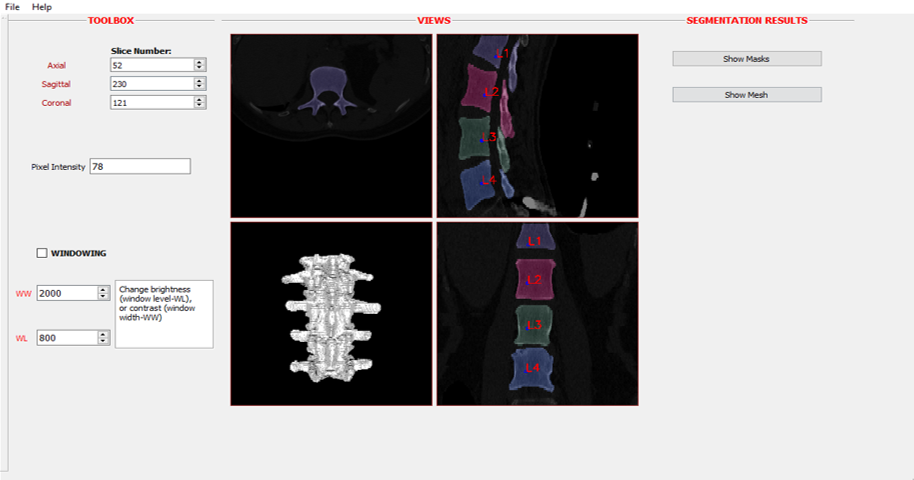

# Visualization Tool

An image depicting the visualization tool realized during this work is here:



------------------------------------------------------------------------------

## Sources

In this folder there are the following files
- Header (`.h`) and source (`.cpp`) file of the application
- Qt User Interface file (`.ui`)
- Main file for creating executable (`main.cpp`)

Qt Extension: 
[Qt Visual Studio Tools 2.5.2](https://www.qt.io/blog/qt-visual-studio-tools-2.5.2-released).

After installation of this extension, create a project of the type `QTGuiApplication` which automatically 
generates `.ui` file and open it in `Qt Designer`.

Libraries:
<ul>
<li> ITK 5.0 </li>
<li> VTK 8.2 </li>
<li> OpenCV 4.2.0 </li>
</ul>

Add the following in the `.pro` file as directives for the linker:

ITK:
```
LIBS += -L$$LIB_PATH/path/to/itk/lib -lITKCommon-5.0 -lITKDICOMParser-5.0 -lITKBiasCorrection-5.0 -lITKDeprecated-5.0 -lITKEXPAT-5.0 -lITKIOBMP-5.0
-lITKIOBioRad-5.0 -lITKIOBruker-5.0 -lITKIOCSV-5.0 -lITKIODCMTK-5.0 -lITKIOGDCM-5.0 -lITKIOGE-5.0 -lITKIOGIPL-5.0 -lITKIOHDF5-5.0 -lITKIOIPL-5.0
-lITKIOImageBase-5.0 -lITKIOJPEG-5.0 -lITKIOJPEG2000-5.0 -lITKIOLSM-5.0 -lITKIOMINC-5.0 -lITKIOMRC-5.0 -lITKIOMeshBYU-5.0 -lITKIOMeshBase-5.0 -lITKIOMeshFreeSurfer-5.0
-lITKIOMeshGifti-5.0 -lITKIOMeshOBJ-5.0 -lITKIOMeshOFF-5.0 -lITKIOMeshVTK-5.0 -lITKIOMeta-5.0 -lITKIONIFTI-5.0 -lITKIONRRD-5.0 -lITKIOPNG-5.0 -lITKIOSiemens-5.0 -lITKIOSpatialObjects-5.0
-lITKIOStimulate-5.0 -lITKIOTIFF-5.0 -lITKIOTransformBase-5.0 -lITKIOTransformHDF5-5.0 -lITKIOTransformInsightLegacy-5.0 -lITKIOTransformMatlab-5.0 -lITKIOVTK-5.0 -lITKIOXML-5.0
-lITKKLMRegionGrowing-5.0 -lITKLabelMap-5.0 -lITKMesh-5.0 -lITKMetaIO-5.0 -lITKNrrdIO-5.0 -lITKOptimizers-5.0 -lITKOptimizersv4-5.0 -lITKPath-5.0 -lITKPolynomials-5.0 -lITKQuadEdgeMesh-5.0
-lITKSpatialObjects-5.0 -lITKStatistics-5.0 -lITKTestKernel-5.0 -lITKTransform-5.0 -lITKTransformFactory-5.0 -lITKVNLInstantiation-5.0 -lITKVTK-5.0 -lITKVideoBridgeOpenCV-5.0
-lITKVideoCore-5.0 -lITKVideoIO-5.0 -lITKVtkGlue-5.0 -lITKWatersheds-5.0 -lITKgiftiio-5.0 -lITKniftiio-5.0 -lITKznz-5.0 -litkIOTransformDCMTK-5.0 -litkNetlibSlatec-5.0 -litkdouble-conversion-5.0
-litkgdcmCommon-5.0 -litkgdcmDICT-5.0 -litkgdcmDSED-5.0 -litkgdcmIOD-5.0 -litkgdcmMEXD-5.0 -litkgdcmMSFF-5.0 -litkgdcmcharls-5.0 -litkgdcmjpeg12-5.0 -litkgdcmjpeg16-5.0
-litkgdcmjpeg8-5.0 -litkgdcmopenjp2-5.0 -litkgdcmsocketxx-5.0 -litkjpeg-5.0 -litklbfgs-5.0 -litkminc2-5.0 -litknetlib-5.0 -litkopenjpeg-5.0 -litkpng-5.0 -litksys-5.0 -litktestlib-5.0
-litktiff-5.0 -litkv3p_netlib-5.0 -litkvcl-5.0 -litkvnl-5.0 -litkvnl_algo-5.0 -litkzlib-5.0 -llibitkhdf5 -llibitkhdf5_cpp
-ldcmdata -ldcmdsig -ldcmfg -ldcmimage -ldcmimgle -ldcmiod -ldcmjpeg -ldcmjpls -ldcmnet -ldcmpmap -ldcmpstat -ldcmqrdb -ldcmrt -ldcmseg -ldcmsr -ldcmtls -ldcmtract -ldcmwlm
-lcharls -lcmr -li2d -lijg12 -lijg16 -lijg8 -loflog -lofstd
```

VTK
```
LIBS += -L$$LIB_PATH/path/to/vtk/lib -l vtkChartsCore-8.2 -lvtkCommonColor-8.2 -lvtkCommonComputationalGeometry-8.2 -lvtkCommonCore-8.2 -lvtkCommonDataModel-8.2 -lvtkCommonExecutionModel-8.2 -lvtkCommonMath-8.2
-lvtkCommonMisc-8.2 -lvtkCommonSystem-8.2 -lvtkCommonTransforms-8.2 -lvtkDICOMParser-8.2 -lvtkDomainsChemistry-8.2 -lvtkDomainsChemistryOpenGL2-8.2 -lvtkFiltersAMR-8.2 -lvtkFiltersCore-8.2
-lvtkFiltersExtraction-8.2 -lvtkFiltersFlowPaths-8.2 -lvtkFiltersGeneral-8.2 -lvtkFiltersGeneric-8.2 -lvtkFiltersGeometry-8.2 -lvtkFiltersHybrid-8.2 -lvtkFiltersHyperTree-8.2 -lvtkFiltersImaging-8.2 
-lvtkFiltersModeling-8.2 -lvtkFiltersParallel-8.2 -lvtkFiltersParallelImaging-8.2 -lvtkFiltersPoints-8.2 -lvtkFiltersProgrammable-8.2 -lvtkFiltersSMP-8.2 -lvtkFiltersSelection-8.2
-lvtkFiltersSources-8.2 -lvtkFiltersStatistics-8.2 -lvtkFiltersTexture-8.2 -lvtkFiltersTopology-8.2 -lvtkFiltersVerdict-8.2 -lvtkGUISupportQt-8.2 -lvtkGUISupportQtOpenGL-8.2 -lvtkGUISupportQtSQL-8.2 -lvtkIOCityGML-8.2
-lvtkIOAMR-8.2 -lvtkGeovisCore-8.2 -lvtkIOAsynchronous-8.2 -lvtkIOCore-8.2 -lvtkIOEnSight-8.2 -lvtkIOExodus-8.2 -lvtkIOExport-8.2 -lvtkIOExportOpenGL2-8.2 -lvtkIOExportPDF-8.2 -lvtkIOGeometry-8.2
-lvtkIOImage-8.2 -lvtkIOImport-8.2 -lvtkIOInfovis-8.2 -lvtkIOLSDyna-8.2 -lvtkIOLegacy-8.2 -lvtkIOMINC-8.2 -lvtkIOMovie-8.2 -lvtkIONetCDF-8.2 -lvtkIOPLY-8.2 -lvtkIOParallel-8.2
-lvtkIOParallelXML-8.2 -lvtkIOSQL-8.2 -lvtkIOSegY-8.2 -lvtkIOTecplotTable-8.2 -lvtkIOVeraOut-8.2 -lvtkIOVideo-8.2 -lvtkIOXML-8.2 -lvtkIOXMLParser-8.2 -lvtkImagingColor-8.2 -lvtkImagingCore-8.2
-lvtkImagingFourier-8.2 -lvtkImagingGeneral-8.2 -lvtkImagingHybrid-8.2 -lvtkImagingMath-8.2 -lvtkImagingMorphological-8.2 -lvtkImagingSources-8.2 -lvtkImagingStatistics-8.2 
-lvtkImagingStencil-8.2 -lvtkInfovisCore-8.2 -lvtkInfovisLayout-8.2 -lvtkInteractionImage-8.2 -lvtkInteractionStyle-8.2 -lvtkInteractionWidgets-8.2 -lvtkNetCDF-8.2 -lvtkParallelCore-8.2
-lvtkRenderingAnnotation-8.2 -lvtkRenderingContext2D-8.2 -lvtkRenderingContextOpenGL2-8.2 -lvtkRenderingCore-8.2 -lvtkRenderingFreeType-8.2 -lvtkRenderingGL2PSOpenGL2-8.2 
-lvtkRenderingImage-8.2 -lvtkRenderingLOD-8.2 -lvtkRenderingLabel-8.2 -lvtkRenderingOpenGL2-8.2 -lvtkRenderingQt-8.2 -lvtkRenderingVolume-8.2 -lvtkRenderingVolumeOpenGL2-8.2
-lvtkViewsContext2D-8.2 -lvtkViewsCore-8.2 -lvtkViewsInfovis-8.2 -lvtkViewsQt-8.2 -lvtkdoubleconversion-8.2 -lvtkexodusII-8.2 -lvtkexpat-8.2 -lvtkfreetype-8.2 -lvtkgl2ps-8.2
-lvtkglew-8.2 -lvtkhdf5-8.2 -lvtkhdf5_hl-8.2 -lvtkjpeg-8.2 -lvtkjsoncpp-8.2 -lvtklibharu-8.2 -lvtklibxml2-8.2 -lvtklz4-8.2 -lvtklzma-8.2 -lvtkmetaio-8.2 -lvtkogg-8.2
-lvtkpng-8.2 -lvtkproj-8.2 -lvtkpugixml-8.2 -lvtksqlite-8.2 -lvtksys-8.2 -lvtktheora-8.2 -lvtktiff-8.2 -lvtkverdict-8.2 -lvtkzlib-8.2
```
